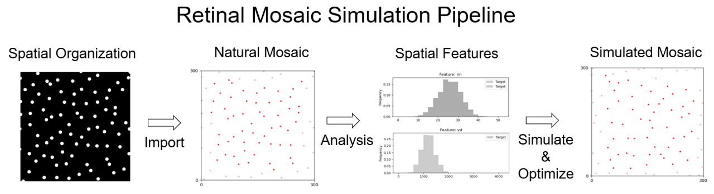

# OPIPP: Optimization-based Pairwise Interaction Point Process

A Python implementation of **OPIPP**, a method for precisely generating [*retinal mosaics*](tutorial/0.background.md#retinal-mosaic) by  neural [*spatial patterns*](tutorial/0.background.md#spatial-pattern-analysis). 




# Install

## PyPI (pip)

```console
pip install git+https://github.com/heliy/OPIPP
```

or 

```console
pip install OPIPP
```

## Dependencies

- python >=3.8
- numpy >= 1.20.0
- scipy >= 1.9.0
- matplotlib >= 3.2.0
- networkx >= 2.0.0
 

# Quick start

We propose a short tutorial, as
1. [Short introduction of backgrounds](tutorial/0.background.md)
2. [Importing retinal spatial pattern datasets from local files](tutorial/1.import.md)
3. [Analyzing and visualizing spatial patterns of mosaics](tutorial/2.analysis.md)
4. [Generating artifial retinal mosaics](tutorial/3.simulation.md)
5. [Tools for parameter estimation and parallelized processing](tutorial/4.external_tools.md)
6. [Customizing features and the optimization](tutorial/5.extension.md)

# Example

# TODO

# References


