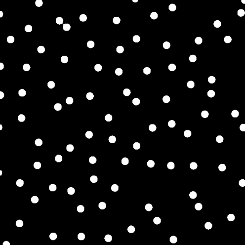
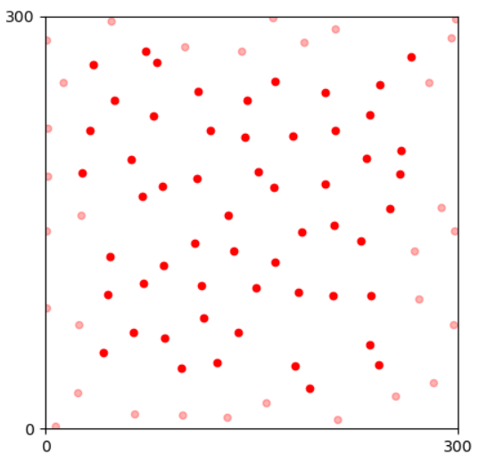
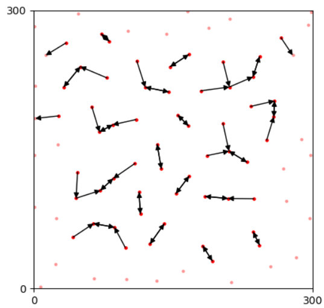
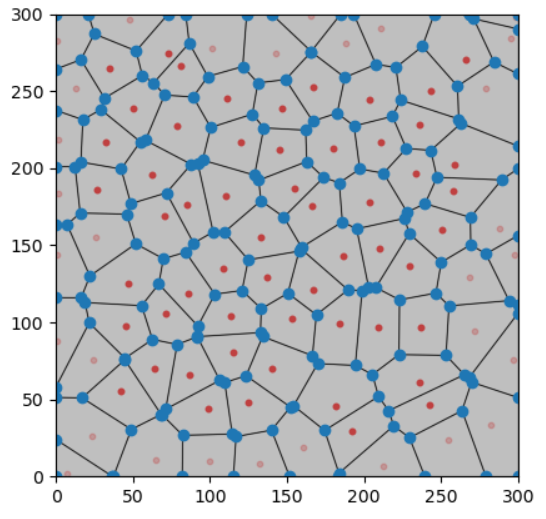
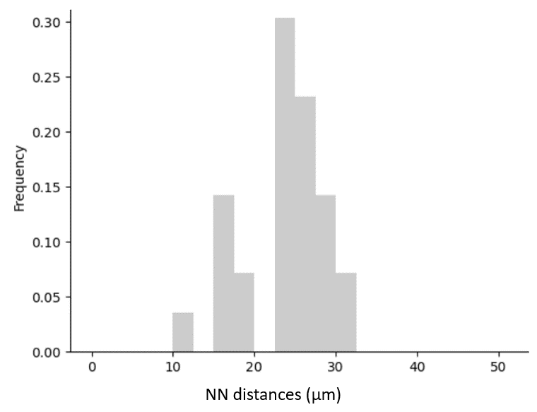

# Retinal Mosaic

Homotypic retinal neurons are positioned in a specific depth inside the tissue and we use **mosaic** to refer to the spatial arrangement of these neurons. With anatomy experiments, we observe natural retinal mosaics in a small area. For example, here is an image that contains ~90 somas of horizontal cells in a 300μm x 300μm area.

<figcaption align = "center">Somas of horizontal cells in a mouse retina.</figcaption>

Then, we calculate the centroids of somas and get the corresponding mosaic referring to the **spatial pattern** of the neural organization of this cell type.

<figcaption align = "center">The corresponding retinal mosaic.</figcaption>

The mosaic **simulation** generates artificial retinal mosaics with spatial patterns **similar** to natural ones. Next, we introduce pattern analysis methods for mosaics. Last, we present the simulation algorithm implemented in this module. 

Related methods are inherited from studies in [Point pattern analysis (PPA)](https://en.wikipedia.org/wiki/Point_pattern_analysis) and applicated in retinal mosaics. For more detailed information, please check [this book](https://link.springer.com/chapter/10.1007/978-94-007-3858-4_12).

# Spatial Pattern Analysis

The spatial organization of most retinal mosaics is **semi-regular**, neither random nor regular with grids. Spatial features quantitatively describe patterns of neural arrangements and yield differences among cell types. For a single mosaic, we discard boundary points, extract features, and calculate regularity indices (RIs) based on features. For a series of mosaics, we summarize features from all mosaics and calculate corresponding RIs.

## Boundary effects

Boundary points that are near to boundaries than others are labeled before feature extraction, as their unclear surrounding introduce problems in analysis. In contrast, We label safe points as **effective** ones and later analysis only carries on these points.

<figcaption align = "center">Boundary (transparent) and effective (solid) points.</figcaption>

## Spatial features

This module currently implements the Nearest Neighbor (NN) distance and the Voronoi Domain (VD) area for each point in a mosaic. We plan to add the effective radius and K/L/G functions in future development. 

- Nearest Neighbor Distance

The nearest neighbor (NN) distance of a point is the smallest Euclidean distance to other points.

<figcaption align = "center">Nearest neighbors of points.</figcaption>

- Voronoi Domain Area

The Voronoi diagram split the entire plane into domains belonging to each point. Any location inside a domain is closer to the center point rather than others. 

<figcaption align = "center">Voronoi Domains of points.</figcaption>

- Probabilistic distribution of features

Based on NN distances and VD areas of points, we can yield a probabilistic distribution by summarizing features of points from a mosaic or a series of mosaics. For example, the distribution of NN distances in the example mosaic is

<figcaption align = "center">Probability distribution of NN distances.</figcaption>

## Regularity Index

The Regularity Index (RI) is the ratio between the average value and the standard deviation of values. There are the Nearest Neighbor Regularity Index (NNRI) and the Voronoi Domain Regularity Index (VDRI) indicating the regularity of a given mosaic or a series of mosaics from a cell type.

# Mosaic Simulation

The routine of a mosaic simulation in this module is the **insert-update-optimize** framework that begins by inserting all cells randomly, updating points by finite iterations, and ensuring the updation towards spatial patterns by an optimization process. The updation of points is based on the **Pairwise Interaction Point Process (PIPP)** which accepts new positions depending on distances to other points. In this section, we introduce the updation based on the PIPP and the optimization process works after an updation step.

## Pairwise Interaction Point Process Updation

The updation of a cell is removing and re-inserting it at a new position with a probability estimated by the Pairwise Interaction Point Process. The probability of a position $p(x_i)$ is depending on distances to other cells, as

$$p(x_i)=\prod_{j}h(u(x_i, x_j)),$$

where $j$ denotes the index of other cells, $u(x_i, x_j)$ denotes the distance between the i-th cell and the j-th cell. $h(u)$ is the *interaction function* yielding the probability of an intra-cellular distance in a given mosaic pattern. Currently, we recommend a [`R` script](estimate_inter_ps.md) to estimate parameters in $h(u)$. 

Each iteration involves a small percentage (1% in default) of cells in a mosaic. Every lucky guy must find a new position and yield a random value smaller than $p(x)$, indicating the random process is acceptable.

## Optimization with Spatial Pattern Features

For optimization, we define the **Entropy** of a simulated mosaic, as

$$Entropy(Simulated)=\sum_{feature}KL(Feature(Simulated), Target_{feature})),$$

where $feature$ and $Feature$ denote a spatial feature and the related method that calculates the probabilistic distribution of features in a given mosaic. The $Entropy$ is the sum of KL divergence between distributions from the simulated mosaic and the $target$.

After an iteration, we calculate the $Entropy$ of the new mosaic and determine whether to accept the iteration or not with a simulated annealing optimization process. We detailedly discuss parameters and schedules in [here](3.simulation.md#optimization-routine).

