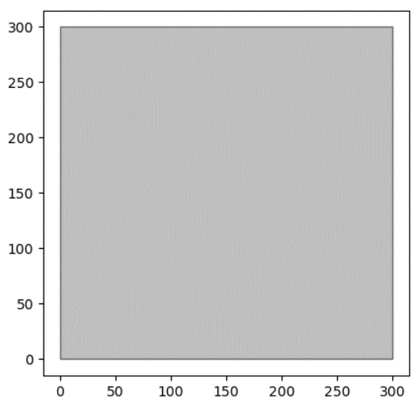

Table of Contents
- [Overview](#overview)
- [Define the plane](#define-the-plane)
  - [Creating a `Scope`](#creating-a-scope)
  - [Methods in `Scope`](#methods-in-scope)
- [Load and save a `Mosaic`](#load-and-save-a-mosaic)
  - [Loading a `Mosaic`](#loading-a-mosaic)
  - [Saving a `Mosaic`](#saving-a-mosaic)
- [`Pattern` to organize mosaics of a cell type](#pattern-to-organize-mosaics-of-a-cell-type)
  - [Creating a `Pattern`](#creating-a-pattern)
  - [Information in a `Pattern`](#information-in-a-pattern)
  - [Adding `Mosaic`s one by one](#adding-mosaics-one-by-one)
  - [Getters and the Remover](#getters-and-the-remover)
  - [Saving \& loading multiple `Mosaic`s](#saving--loading-multiple-mosaics)


# Overview

This part can help you load and save mosaics from local files, as well as manage multiple mosaics. We use the [horizontal cell (HC) mosaic](0.background.md) as the example case.

Import related classes of OPIPP first. 

```python
from OPIPP import Scope, Mosaic, Pattern
```
`Scope`, `Mosaic`, and `Pattern` are basic classes in managing and viewing retinal mosaics. Alternatively, you can import all classes and methods as,

```python
from OPIPP import *
```

# Define the plane

## Creating a `Scope`
Create a rectangle area to present the plane of the mosaic. For example, the plane of the HC mosaic is a 300μm x 300μm area. 

```python
EDGE_LEN = 300 # the length of two sides
scope = Scope(min_x=0, max_x=EDGE_LEN, # x-axis
              min_y=0, max_y=EDGE_LEN) # y-axis
```

## Methods in `Scope`

By definition, a `Scope` is a class to describe the plane. It provides several methods to access the properties of the plane, such as,

```python
# lengthes of x/y sides
scope.get_edges_len() # (300, 300)

# the area of the plane
scope.get_area() # 90000

# the coordinate of the center
scope.get_center() # (150.0, 150.0)

# four corners
scope.get_corners() # ([0, 300], [0, 0], [300, 0], [300, 300])

# draw the plane
# You can customize colors and the alpha of the plane
scope.view(edgecolor="k", facecolor="gray", alpha=0.5)
```

<p align="center">

<figcaption align = "center">The plane for mosaics.</figcaption>
</p>

**_NOTE:_** The `Scope` forbids rotation of the rectangle. 

# Load and save a `Mosaic`

A **N x 2** matrix holding coordinates of **N** points is stored in the file [examples/natural/HC/F8-1-points.txt](https://github.com/heliy/OPIPP/blob/main/examples/natural/HC/F8-1-points.txt), as

```texture
7.541899441340782495e+00 1.425267881674145976e+00
2.121728903263745849e+02 6.430094089973536597e+00
1.323392000791021985e+02 7.986849260888910784e+00
6.489593118109458203e+01 1.042665743807781631e+01
... ...
```

## Loading a `Mosaic`

A `Mosaic` object requires a `scope` and points, as

```python
import numpy as np

# load 2D points
natural_points = np.loadtxt("examples/natural/HC/F8-1-points.txt")

# create a mosaic
natural_mosaic = Mosaic(points=natural_points, scope=scope)
```
**_NOTE:_** The `Mosaic` discards points that are outside the range of the `Scope`. 

You can store coordinates into a .npy binary file and use `np.load` to load the matrix by choice. Further, you can check points in the `mosaic` as

```Python
natural_mosaic.draw_points()
```
<p align="center">

<figcaption align = "center">The imported retinal mosaic.</figcaption>
</p>

## Saving a `Mosaic`

The `mosaic` provides a `save` method to store points as local files.

```Python
# save coordinates into a texture file
natural_mosaic.save("examples/natural/HC/F8-1-points.txt", separate=False)

# Separate coordinates into two texture files
# the 1st is "examples/natural/HC/F8-1-points-x.txt" with x-coordinates
# the 2nd is "examples/natural/HC/F8-1-points-y.txt" with y-coordinates
natural_mosaic.save("examples/natural/HC/F8-1-points.txt", separate=True)
```

The `Mosaic` class offers several methods for feature analysis and visualization. The [next guide](2.analysis.md) presents a detailed description.

# `Pattern` to organize mosaics of a cell type

## Creating a `Pattern`

We provide the class `Pattern` to organize natural and simulated mosaics of a cell type. You need to name the type and create a `pattern` as,

```python
# The name of the cell type
CELLNAME = "Mouse Horizontal Cell"
pattern = Pattern(name=CELLNAME)
```
## Information in a `Pattern`

You can directly use `print` to check information of `pattern`, as

```python
print(pattern)
```

Here, the outputs are

```texture
Spatial pattern of Mouse Horizontal Cell, 
- Density: Unknown,
- Natural mosaics: 0 case(s),
- Simulated mosaics: total 0 case(s),
- Features: 0.
```

Besides the name of the cell type, the outputs list
- The density of cells, useful in simulation,
- Natural mosaics in the pattern,
- Simulated mosaics in the pattern,
- Spatial features for pattern analysis and mosaic simulation.

## Adding `Mosaic`s one by one

Next, we add mosaics into the `pattern`, as

```python
# add a natural mosaic
pattern.add_natural_mosaic(natural_mosaic)

# Load a simulated mosaic
simulated_points = np.loadtxt("examples/simulated/HC/W1_0.points")
simulated_mosaic = Mosaic(points=simulated_points, scope=scope)

# Add a simulated mosaic
pattern.add_simulated_mosaic(natural_mosaic, tag="S")

print(pattern)
```

Notably, you need to specify whether the mosaic is a natural one or a simulated one. When adding a simulated mosaic, we recommend using a `tag` to manage mosaics from different simulation processes. In the above, we add a mosaic with `tag="S"`, and the `print` lists the number of simulated mosaics in different tags, as

```texture
Spatial pattern of Mouse Horizontal Cell,
- Density: Unknown,
- Natural mosaics: 1 case(s),
- Simulated mosaics: total 1 case(s),
   0 case(s) in tag 'default',
   1 case(s) in tag 'S',
- Features: 0.
```

The `default` tag is used if not specific.

## Getters and the Remover

You can access the `mosaic` with its index and the `tag` if it is an simulated one, as

```python
simulated_mosaic = pattern.get_simulated_mosaic(index=0, tag="S") # tag="default" if not specific
natural_mosaic = pattern.get_natural_mosaic(index=0)
```
**_NOTE:_**  If not includes `tag` or `index` out of range, these getters will return a `None` instead of raising an `Error`. 

The `pattern` has a `remove_mosaic` method to discard mosaics inside, as

```python
# Discard simulated mosaics in tag "S", tag="default" if not specific
pattern.remove_mosaics(with_natural=False, simulated_tag="S")

# If with_natural=True, it also discards natural mosaics.
# If simulated_tag=None, it discards all simulated mosaics
# Therefore, this line discards all mosaics in the pattern
pattern.remove_mosaics(with_natural=True, simulated_tag=None)
```

## Saving & loading multiple `Mosaic`s

We recommend using `load_from_files` to create multiple mosaics, as

```python
pattern.load_from_files(point_fnames=["examples/natural/HC/F8-1-points.txt"], scope=scope, is_natural=True)

from glob import glob

# list of file names
points_files = glob("examples/simulated/HC/W1_*.points")
# specifiy the tag of simulated mosiacs, # tag="default" if not specific
_ = pattern.load_from_files(point_fnames=points_files, scope=scope, is_natural=False, simulated_tag="O-PIPP")
points_files = glob("examples/simulated/HC/PIPP_*.points")
_ = pattern.load_from_files(point_fnames=points_files, scope=scope, is_natural=False, simulated_tag="PIPP")

print(pattern)
```
The `point_fnames` is a list of file names containing coordinates. This method creates a `mosaic` with points from a file. You also need to provide the `scope` and specify whether these mosaics are natural or simulated. 

Here, we load files and use two tags to distinguish two batches of mosaics. The outputs of `print` is

```texture
Spatial pattern of Mouse Horizontal Cell, 
- Density: Unknown,
- Natural mosaics: 1 case(s),
- Simulated mosaics: total 30 case(s),
   0 case(s) in tag 'default',
   10 case(s) in tag 'O-PIPP',
   20 case(s) in tag 'PIPP',
- Features: 0.
```

The `Pattern` also has a `dump_to_file` method to save points in multiple mosaics, as
```python
pattern.dump_to_files(prefix="examples/simulated/HC/PIPP",
    ext="points", is_natural=False, separate=False, 
    simulated_tag="PIPP")
# tag="default" if not specific when is_natural=False
```
where the `prefix` and the `ext` arguments define the name of output files. For the i-th mosaic, points are stored in the `prefix_i.ext` file. The `is_natural` and the `simulated_tag` arguments here are used to decide which list of mosaics. The `separate` argument decides if separately store coordinates.
