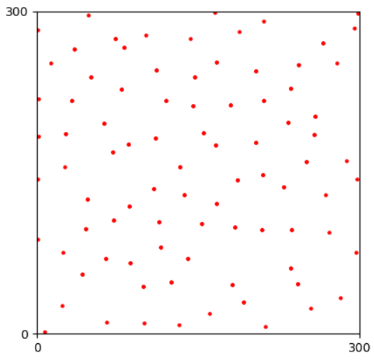

# Overview

This part is the I/O of the module, including load mosaics from local files, and dump mosaics into local files.

```python
import numpy as np
from OPIPP import Scope, Mosaic, Pattern
```

# `Scope` of the rectangle area

```python
EDGE_LEN = 300
scope = Scope(min_x=0, max_x=EDGE_LEN, 
              min_y=0, max_y=EDGE_LEN)
```

# Load and dump a `Mosaic`

```texture
7.541899441340782495e+00 1.425267881674145976e+00
2.121728903263745849e+02 6.430094089973536597e+00
1.323392000791021985e+02 7.986849260888910784e+00
6.489593118109458203e+01 1.042665743807781631e+01
... ...
```

```python
natural_points = np.loadtxt("examples/natural/HC/F8-1-points.txt")
natural_mosaic = Mosaic(points=natural_points, scope=scope)

simulated_points = np.loadtxt("examples/simulated/HC/W1_0.points")
simulated_mosaic = Mosaic(points=simulated_points, scope=scope)
```

```Python
natural_mosaic.draw_points()
```
<p align="center">

<figcaption align = "center">The imported retinal mosaic.</figcaption>
</p>

For visaulization, check.

```Python
#
natural_mosaic.save("examples/natural/HC/F8-1-points.txt", split=False)

# 
natural_mosaic.save("examples/natural/HC/F8-1-points.txt", split=True)
```

# Use `Pattern` to organize mutiple mosaics of a cell type

```python
CELLNAME = "Mouse Horizontal Cell"
pattern = Pattern(name=CELLNAME)
```

```python
pattern.add_natural_mosaic(natural_mosaic)
pattern.add_simulated_mosaic(natural_mosaic)

print(pattern)
```

```texture
Spatial pattern of Mouse Horizontal Cell,
- Density: Unknown,
- Natural mosaics: 1 samples,
- Simulated mosaics: total 1 samples
   1 samples in tag 'default',
- Features: 0.
```

```python
pattern.clear_mosaics(with_natural=True)
print(pattern)
```

```texture
Spatial pattern of Mouse Horizontal Cell,
- Density: Unknown,
- Natural mosaics: 0 samples,
- Simulated mosaics: total 0 samples,
- Features: 0.
```

```python
pattern.load_from_files(["examples/natural/HC/F8-1-points.txt"], scope=scope, is_natural=True)
```

```python
from glob import glob
points_files = glob("examples/simulated/HC/W1_*.points")
_ = pattern.load_from_files(points_files, scope=scope, is_natural=False, simulated_tag="O-PIPP")
points_files = glob("examples/simulated/HC/PIPP_*.points")
_ = pattern.load_from_files(points_files, scope=scope, is_natural=False, simulated_tag="PIPP")

print(pattern)
```

```texture
Spatial pattern of Mouse Horizontal Cell, 
- Density: Unknown,
- Natural mosaics: 1 samples,
- Simulated mosaics: total 30 samples
   0 samples in tag 'default',
   10 samples in tag 'O-PIPP',
   20 samples in tag 'PIPP',
- Features: 0.
```

```python
pattern.dump_to_files(prefix="examples/simulated/HC/PIPP",
    ext="points", is_natural=False, split=False, 
    simulated_tag="PIPP")
```


