- [Overview](#overview)
- [Spatial features of a `Mosaic`](#spatial-features-of-a-mosaic)
  - [Boundary effects](#boundary-effects)
  - [Visualization of points](#visualization-of-points)
  - [Neighborhoods in a `Mosaic`](#neighborhoods-in-a-mosaic)
  - [Nearest Neighbor distances](#nearest-neighbor-distances)
  - [Voronoi Domain areas](#voronoi-domain-areas)
  - [Regularity Index](#regularity-index)
- [Features and their probability distributions](#features-and-their-probability-distributions)
  - [Define a distribution](#define-a-distribution)
  - [Set probabilities in `Distribution`](#set-probabilities-in-distribution)
    - [Estimate probabilities from mosaics](#estimate-probabilities-from-mosaics)
    - [Set probabilities directly](#set-probabilities-directly)
  - [Visualization of probabilities](#visualization-of-probabilities)
    - [View probabilities of features from `Mosiac`s](#view-probabilities-of-features-from-mosiacs)
    - [Compare features among `Mosiac`s](#compare-features-among-mosiacs)

# Overview

This part guides the feature analysis and visualization of mosaics. Codes here follow [the 1st part](1.import.md) of the tutorial, you should run previous codes first. 

For customizable visualization, it is necessary to import
the `matplotlib` library, as
```python
import matplotlib.pyplot as plt
```

# Spatial features of a `Mosaic`

In this section, we introduce how to analyze and visualize [spatial features](0.background.md#spatial-pattern-analysis) in a single mosaic. We use [the natural mosaic](1.import.md#loading-a-mosaic) to present usages and results.

## Boundary effects 

Due to [boundary effects](0.background.md#boundary-effects), the first step in feature analysis is to label boundary points in the mosaic, and later statistics will skip these points. The `Mosaic` class provides two methods to access indices of boundary or effective points separately, as,

```python
# a numpy.darray(dtype=int) contains indices of boundary points
boundary_indices = natural_mosaic.get_boundary_indices()

# a numpy.darray(dtype=int) contains indices of effective points
effective_indices = natural_mosaic.get_effective_indices()
```
Besides, you can randomly select points with a given number by the `get_random_indices` method, as

```python
# a numpy.darray(dtype=int) contains indices of random points
random_indices = natural_mosaic.get_random_indices(n=30) 
# If n >= the number of points, it will return all indices with a random order 
```

## Visualization of points

We draw the above points in the `natural_mosaic` as the example to introduce visualization methods in `Mosiac`. Next is how to draw effective points by using the `draw_points` method.

```python
natural_mosaic.draw_points(highlights=effective_indices, nonhighlight_alpha=0.5, ax_grid=5, draw_plane_grid=True, ax_scaled=True, point_args={"color": "k", "s": 20}, ax=None) 
```

<p align="center">
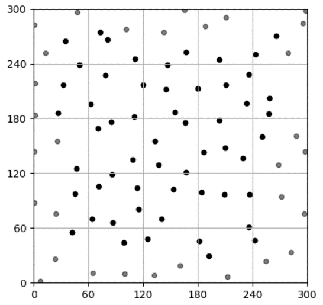
<figcaption align = "center">Draw effective points in the mosaic.</figcaption>
</p>

The `draw_points` method has several arguments for setting highlight points, the properties of the axes and points, as
- `highlights`: Indices of solid points, default is `None`, and the method will highlight effective points.
- `nonhighlight_alpha`: Alpha of parent points, default is `0.3`.
- `ax_grid`: The number of ax-ticks in a side, default is `1`.
- `draw_plane_grid`: Whether draw grids with ax-ticks, default is `False`.
- `ax_scaled`: If it is True, the unit of x and y sides are same. Otherwise, two sides have the same length without other commands with the axes. Please visit the manual of [matplotlib.axes.Axes](https://matplotlib.org/stable/api/_as_gen/matplotlib.axes.Axes.html) for more information.
- `point_args`: Arguments that are delivered into the [matplotlib.axes.Axes.scatter](https://matplotlib.org/stable/api/_as_gen/matplotlib.axes.Axes.scatter.html) method to control properties of points. In the above sentence, we set the color of points as `k` (black) and the size of points as `20`. **__NOTE__:** If it has `alpha`, the alpha of un-highlight points is the multiple of given `alpha` and `nonhighlight_alpha` to ensure highlight points are more solid than others.
- `ax`: Drawing with the specified [matplotlib.axes.Axes](https://matplotlib.org/stable/api/_as_gen/matplotlib.axes.Axes.html). If not provided, the method will create new axes and show drawing results at the end.

The next example draws red points and highlights boundary points, as

```python
natural_mosaic.draw_points(highlights=boundary_indices, nonhighlight_alpha=0.2, ax_grid=5, draw_plane_grid=False, ax_scaled=True, point_args={"color": "r", "s": 40}) 
```

<p align="center">
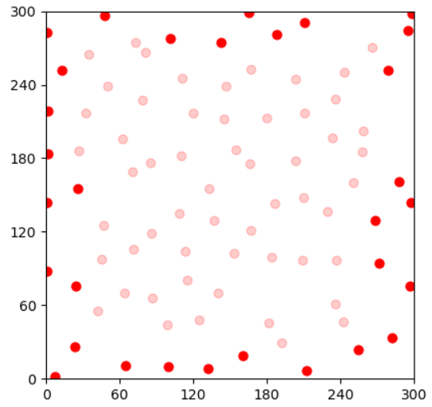
<figcaption align = "center">Draw boundary points in the mosaic.</figcaption>
</p>

With specific axes, you can draw with several subplots. For example, 

```python
# The 1st subplot highlights effective points
ax1 = plt.subplot(131)
natural_mosaic.draw_points(highlights=effective_indices, nonhighlight_alpha=0.2, ax_grid=5, draw_plane_grid=True, ax_scaled=True, point_args={"color": "r", "s": 20}, ax=ax1) 
ax1.set_title("Solid points are effective")

# The 2nd subplot hightlights boundary points
ax2 = plt.subplot(132)
natural_mosaic.draw_points(highlights=boundary_indices, nonhighlight_alpha=0.2, ax_grid=5, draw_plane_grid=True, ax_scaled=True, point_args={"color": "r", "s": 20}, ax=ax2)
ax2.set_title("Solid points are boundary")

# The 3rd subplot hightlights randomly selected points
ax3 = plt.subplot(133)
natural_mosaic.draw_points(highlights=random_indices, nonhighlight_alpha=0.2, ax_grid=5, draw_plane_grid=True, ax_scaled=True, point_args={"color": "r", "s": 20}, ax=ax3)
ax3.set_title("Random (N=30) Selection")

# Show drawing results
plt.show() 
```

<p align="center">
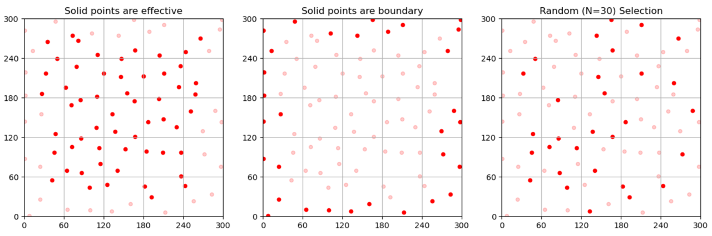
<figcaption align = "center">Draw points with subplots.</figcaption>
</p>

Other visualization methods in `Mosaic` and `Pattern` support the ax-specific approach. Furthermore, similar to the `point_args`, several arguments in these methods are delivered into visualization methods in `maplotlib`. We recommend to check the manual of [matplotlib](https://matplotlib.org/stable/index.html) for more information.

## Neighborhoods in a `Mosaic`

The 2nd step of feature analysis is the [triangulation](https://en.wikipedia.org/wiki/Delaunay_triangulation), whose edges that link neighbors split the plane into triangle areas. With a `Mosaic`, it is easy to view the results of Delaunay triangulation, as

```python
natural_mosaic.draw_neighbors(highlights=None, nonhighlight_alpha=0.3, ax_grid=1, draw_plane_grid=False, ax_scaled=True, point_args={"s": 5, "color": "r"}, edge_args={"lw": 0.5, "color": "gray"}, ax=None)
```
<p align="center">
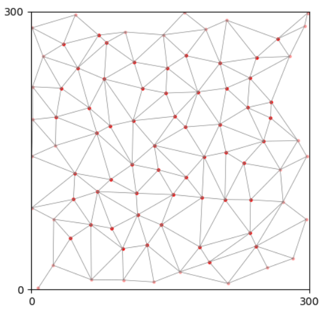
<figcaption align = "center">Pairs of neighborhoods in the mosiac.</figcaption>
</p>

The `draw_neighbors` method shares several arguments with  [draw_points](2.analysis.md#visualization-of-points). Besides, it has an `edge_args` argument which decides the properties of edges in drawing and is delivered into [matplotlib.axes.Axes.plot](https://matplotlib.org/stable/api/_as_gen/matplotlib.axes.Axes.plot.html) method.

Furthermore, there is a `find_neighbors` method to get neighbors of a given index, as

```python
guy = 16 # We try to find the neighbors of this guy.
# get a list of indices of neighbors. 
neighbors = natural_mosaic.find_neighbors(p_index=guy, effective_only=False)
```
where `p_index` is the index of the point and the method will discard boundary points in return if `effective_only=True`. By specific the `highlights` argument, we can show the index=16 cell and its neighbors, as

```python
# draw the index=16 cell
ax1 = plt.subplot(121)
natural_mosaic.draw_neighbors(highlights=[guy], nonhighlight_alpha=0.2, ax_grid=5, draw_plane_grid=False, ax_scaled=True, point_args={"color": "red", "s": 30}, edge_args={"lw": 0.5, "color": "gray"}, ax=ax1) 
ax1.set_title("The lucky guy")

# draw its neighbors
ax2 = plt.subplot(122)
natural_mosaic.draw_neighbors(highlights=neighbors, nonhighlight_alpha=0.2, ax_grid=5, draw_plane_grid=False, ax_scaled=True, point_args={"color": "red", "s": 30}, edge_args={"lw": 0.5, "color": "gray"}, ax=ax2)
ax2.set_title("Neighbors of the guy")
plt.show() 
```

<p align="center">
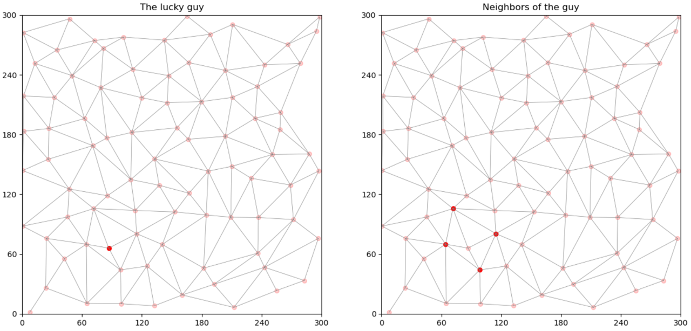
<figcaption align = "center">A cell and its neighbors.</figcaption>
</p>

## Nearest Neighbor distances

The nearest neighbor (NN) and its distance to a point is an important feature. You can use `find_nearest_neighbor` to get the NN and its neighbor, as

```python
# NN distance and the NN neighbor of a point
nn_neighbor, nn_distance = natural_mosaic.find_nearest_neighbor(guy)
# nn_neighbor is the index of the NN neighbor.
# nn_distance is the distance from the point to its NN.
```

You can use `get_nns` to get NN distances from multiple points, as

```python
# NN distances of effective points
effective_nns = natural_mosaic.get_nns(indices=effective_indices, effective_filter=True)

# NN distances of all points
all_nns = natural_mosaic.get_nns(indices=None, effective_filter=False)
```
Arguments in `get_nns` methods are
- `indices` specific indices of query, default is `None` and return NN of all points,
- `effective_filter` Return only NNs of effective points.

The `Mosaic` has a `draw_nn_graph` method to show NN relationships as arcs from points to their NN neighbors.

```python
natural_mosaic.draw_nn_graph(highlights=None, nonhighlight_alpha=0.3, ax_grid=5, draw_plane_grid=False, ax_scaled=True, point_args={"s": 20, "color": "r"}, network_args={"edge_color": "k", "with_labels": False}, ax=None)
```
<p align="center">
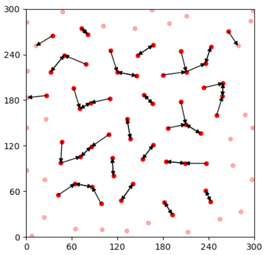
<figcaption align = "center">Effective points and their NN neighbors.</figcaption>
</p>

The `draw_nn_graph` method share most common arguments with  [draw_points](2.analysis.md#visualization-of-points), except
- `highlights`: Only draw NN graphs with given indices, default is `None` (= effective points).
- `network_args`: Arguments are delivered into [networkx.draw_networkx](https://networkx.org/documentation/stable/reference/generated/networkx.drawing.nx_pylab.draw_networkx.html) method to control the properties of the NN graph. **__NOTE__**: Arguments with points here have no effect.

## Voronoi Domain areas

Similarly, there are methods to access areas of Voronoi domains of points.

```python
# VD areas of effective points
effective_vds = natural_mosaic.get_vorareas(indices=None, effective_filter=True)

# VD areas of all points
all_vds = natural_mosaic.get_vorareas(indices=None, effective_filter=False)
```
You can use the `draw_vds` method to show Vornoi domains of a mosaic, as

```python
natural_mosaic.draw_vds(highlights=None, nonhighlight_alpha=0.3, ax_grid=5, ax_scaled=True, plane_args={"facecolor": "gray", "alpha": 0.2}, voronoi_args={"show_points": False, "line_width": 0.5}, point_args={"s": 20, "color": "r"}, ax=None)
```
<p align="center">
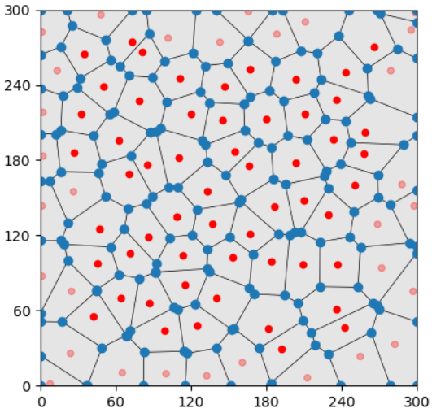
<figcaption align = "center">Voronoid domains in the mosiac.</figcaption>
</p>

The `draw_vds` method share most common arguments with  [draw_points](2.analysis.md#visualization-of-points), except
- `plane_args`: Arguments are delivered into [matplotlib.collections.PatchCollection](https://matplotlib.org/stable/api/collections_api.html) method to control properties of the plane.
- `voronoi_args`: Arguments are delivered into [scipy.spatial.voronoi_plot_2d](https://docs.scipy.org/doc/scipy/reference/generated/scipy.spatial.voronoi_plot_2d.html) method to control properties of VDs. 

## Regularity Index

Based on the values of NN distances and VD areas, you can get [regularity indices](0.background.md#regularity-index) of the mosaic, as

```python
# Nearest Neighbor Regularity Index
natural_mosaic.NNRI() # 4.966138094971688

# Voronoi Domain Regularity Index
natural_mosaic.VDRI() # 5.790713936276296
```

**__NOTE__**: `NNRI` and `VDRI` only use values of effective points to calculate RI.

# Features and their probability distributions

In this section, we use methods in `Pattern` to analyze features of multiple mosaics and get probability distribution. We use a `Distribution` class to define probabilities and interact with `Pattern`. Please import it as

```python
from OPIPP import Distribution
```

## Define a distribution

A `Distribution` object requires an argument to decide how to calculate the feature and several arguments for the [numpy.histogram](https://numpy.org/doc/stable/reference/generated/numpy.histogram.html).

```python
# Distribution of NN distances
nn_distribution = Distribution(method="get_nns", min_value=0, max_value=50, n_bin=20)

# Or a callable method in the definition
# Distribution of VD areas
vd_distribution = Distribution(method=lambda mosaic: mosaic.get_vorareas(), min_value=0, max_value=4000, n_bin=20)
```
The above shows two distributions containing information on NN distances and VD areas respectively. Arguments here are
- `method`: Define how to calculate the features of a mosaic. 
  - If it is a string, the `distribution` will use the corresponding attribute of the mosaic. For example, `nn_distributon` here will call `mosaic.get_nns()` and get values. 
  - If it is a callable function, the `distribution` will call `method(mosaic)` and get values.
- `max_value`: The maximum value for the histogram.
- `min_value`: The minimum value for the histogram, default is `0`.
- `n_bin`: The number of bins in the histogram, default is `1`.

You can use `extract_mosaic` and `extract_mosaics` to get feature values through `distribution`, as

```python
# Same as `natural_mosaic.get_nns()`
features = nn_distribution.extract_mosaic(natural_mosaic)

# Or extract features from a list of mosaics
features = nn_distribution.extract_mosaics([natural_mosaic, simulated_mosaic])
```

The next step is to let the `pattern` know the name of the feature and its distribution, as

```python
pattern.set_feature("NN", nn_distribution)
pattern.set_feature("VD", vd_distribution)
```

## Set probabilities in `Distribution`

There are several approaches to getting the histogram of probabilities of a feature. 

### Estimate probabilities from mosaics

You can estimate the probabilities of values by several methods in `distribution`. For example,

```python
# get values from mosaics
mosaics = [natural_mosaic]
values = nn_distribution.extract_mosaics(mosaics)

# get the histogram
hist = nn_distribution.get_hist(values)

# set the probabilities for optimization
nn_distribution.set_target(hist)
```

The `pattern` has a `set_feature_target` method that applies the above calculation to its natural mosaics.

```python
# Give the name of the feature, it will estimate 
# probabilities and put into the distribution object
probs = pattern.set_feature_target(feature_label="NN")
```
Besides, the `distribution` has a `view` method to draw the histogram of probabilities.

```python
nn_distribution.view(bar_args={}, ax=None)
```

<p align="center">
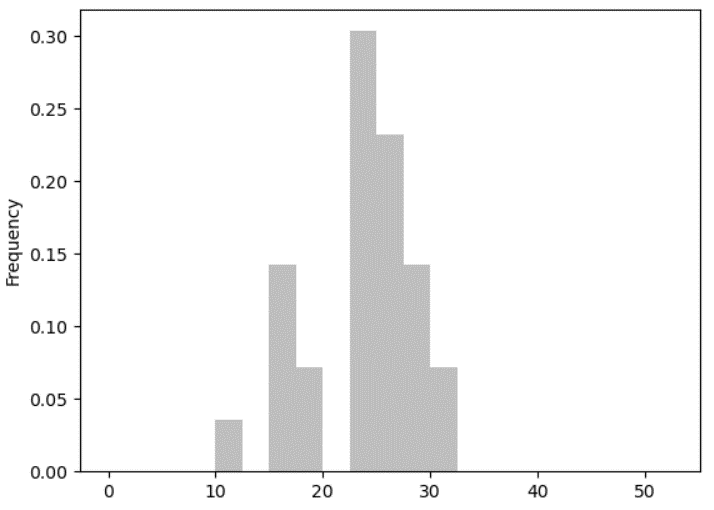
<figcaption align = "center">Histogram of NN distances in the mosaic.</figcaption>
</p>

where `ax` decides the specific axes, `bar_args`(default={}) controls properties of bars and is delivered into the [matplotlib.axes.Axes.bar](https://matplotlib.org/stable/api/_as_gen/matplotlib.axes.Axes.bar.html) method to draw the above picture.

### Set probabilities directly

Alternatively, you can define a numpy.array or a list of probabilities and deliver it into the `distribution` directly. For example,

```python
# data from (Keeley et al., 2020)
target = np.array([0.        , 0.        , 0.        , 0.0016756 , 0.00670241,
       0.02010724, 0.04356568, 0.08713137, 0.11394102, 0.17258713,
       0.16253351, 0.16253351, 0.1152815 , 0.06635389, 0.0325067 ,
       0.01005362, 0.00268097, 0.00134048, 0.00067024, 0.00033512, 
       0]) # n_bin=20 but len(target)=21
       # The last item represents the probability of values
       # larger than the `max_value`. 
nn_distribution.set_target(target)
```

The above probabilities are calculation results from a population of 28 mosaics. It is more significant and stable in statistics. We use this histogram as the optimization target in later simulations. Here is an example that draws two probabilities with subplots.

```python
ax1 = plt.subplot(121)
probs = pattern.set_feature_target(feature_label="NN")
nn_distribution.view(ax=ax1, alpha=0.4, color='gray')
ax1.set_title("Distribution from a mosaic")

ax2 = plt.subplot(122)
nn_distribution.set_target(target)
nn_distribution.view(ax=ax2, alpha=0.7, color='k')
ax2.set_title("Distribution from a dataset")

plt.show()
```
<p align="center">
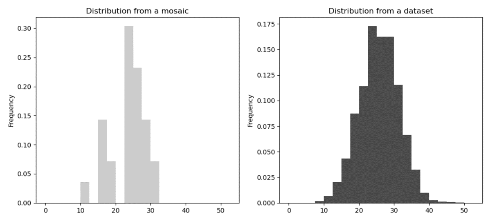
<figcaption align = "center">Histogram of NN distances from multiple mosaics is more significant.</figcaption>
</p>

## Visualization of probabilities

The `Pattern` class also has several visualization methods. Before diving into these useful tools, we need complete features in the `pattern`.

```python
# Set probabilities of VD areas
# Also from (Keeley et al., 2020)
vd_distribution.set_target(np.array([0.        , 0.        , 0.00608906, 0.0617784 , 0.17183275,
       0.27966751, 0.27633813, 0.13262011, 0.05992875, 0.0117453 ,
       0.        , 0.        , 0.        , 0.        , 0.        ,
       0.        , 0.        , 0.        , 0.        , 0.        , 
       0.        ]))

print(pattern)
```

The outputs are

```
Spatial pattern of Mouse Horizontal Cell, 
- Density: Unknown,
- Natural mosaics: 1 case(s),
- Simulated mosaics: total 30 case(s)
   0 case(s) in tag 'default',
   10 case(s) in tag 'O-PIPP',
   20 case(s) in tag 'PIPP',
- Features: 2
         Label  | Has target probabilities
         NN     | True
         VD     | True .
```

Now, the `pattern` object has 1 natural mosaic, 30 simulated mosaics with 2 tags, and 2 features with probabilities in both.

### View probabilities of features from `Mosiac`s

The `draw feature hist` method is for drawing several histograms in the `pattern`, as

```python
pattern.draw_feature_hist(feature_label="NN", natural_color="skyblue", target_color="gray", simulated_color="red", simulated_tag="O-PIPP", bar_args={}, ax=None)
```

<p align="center">
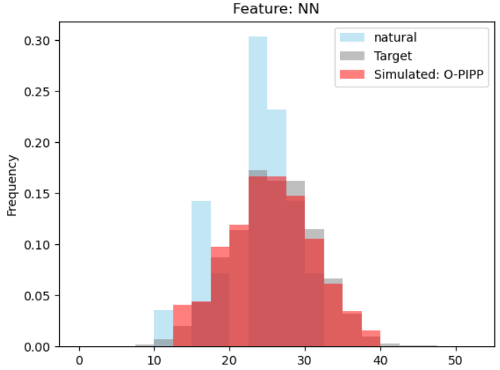
<figcaption align = "center">Natural vs. dataset vs. simulated historgrams.</figcaption>
</p>

Arguments decide users draw specific histograms and their colors.
- `feature_label`: The name of the feature.
- `natural_color`: The color of the histogram from natural mosaics, default=`"skyblue"`. If it is `None`, the method will not draw the histogram.
- `target_color`: The color of the histogram from probabilities, default=`"gray"`. If it is `None`, the method will not draw the histogram.
- `simulated_color`: The color of the histogram from simulated mosaics, default=`"red"`. If it is `None`, the method will not draw the histogram.
- `simulated_tag`: The tag that distinguishes draw which list of simulated mosaics, defalut=`default`.
- `bar_args` and `ax` are the same as arguments in [Mosiac.view](2.analysis.md#estimate-probabilities-from-mosaics).


### Compare features among `Mosiac`s

With the `draw feature hist` method and subplots in `maplotlib`, you can draw histograms to compare features from two tags of simulated mosaics. For example, we plot histograms with NN feature from two groups of simulated mosaics.

```python
# NN features in simulated mosaics with the `O-PIPP` tag
ax1 = plt.subplot(121)
pattern.draw_feature_hist("NN", natural_color=None, target_color="gray", simulated_color="red", simulated_tag="O-PIPP", ax=ax1)

# NN features in simulated mosaics with the `PIPP` tag
ax2 = plt.subplot(122)
pattern.draw_feature_hist("NN", natural_color=None, target_color="gray", simulated_color="red", simulated_tag="PIPP", ax=ax2)

plt.show()
```

<p align="center">
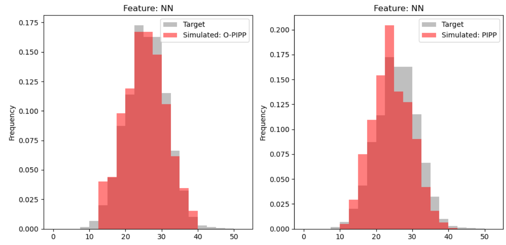
<figcaption align = "center">Compare features in two simulated groups with histograms.</figcaption>
</p>

The `draw_feature_boxes` method uses [matplotlib.axes.Axes.boxplot](https://matplotlib.org/stable/api/_as_gen/matplotlib.axes.Axes.boxplot.html) to compare values of features among different mosaics.

```python
pattern.draw_feature_boxes(feature_label="NN", draw_natural=True, simulated_tags=["O-PIPP", "PIPP"], box_args={}, ax=None)
```
<p align="center">

<figcaption align = "center">Compare features in two simulated groups with boxplot.</figcaption>
</p>

Arguments in `draw_feature_boxes` are the same as `draw_feature_hist`, except the `simulated_tags` which is a list of tags for drawing. If no specific tags, the method will draw all simulated mosaics.

Compare to methods drawing with raw values, the `draw_value_bars` method uses another method to compass values into a single index and use [matplotlib.axes.Axes.bar](https://matplotlib.org/stable/api/_as_gen/matplotlib.axes.Axes.bar.html) to compare values in different groups of mosaics. For example, we define NNRI and VDRI distributions and compare mean values from two groups of simulated mosaics, as

```python
# The NNRI distribution
nnri_distribution = Distribution("NNRI", 10)
pattern.set_feature("NNRI", nnri_distribution)
# The VDRI distribution
vdri_distribution = Distribution("VDRI", 10)
pattern.set_feature("VDRI", vdri_distribution)
# Do not require target probabilities

# Sum mean values of two RIs
pattern.draw_value_bars(value_method=np.mean, feature_colors={"NNRI": "r", "VDRI": "b"}, draw_loss=False, draw_natural=False, simulated_tags=["O-PIPP", "PIPP"], bar_args={"width": 0.3}, ax=None)
```

<p align="center">
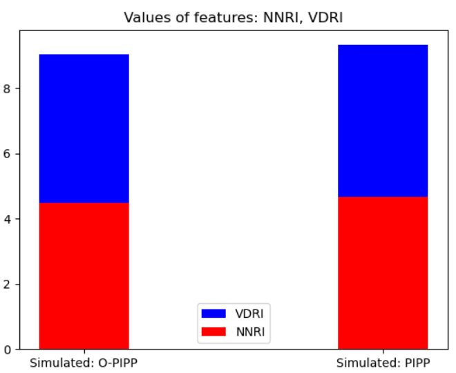
<figcaption align = "center">Compare mean value of features in two simulated groups.</figcaption>
</p>

Arguments in the `draw_value_bars` method are
- `value_method`: A callable function that calculates features into a single float value.
- `feature_colors`: A dictionary that features’ label are its keys and corresponding colors are its values.
- `draw_loss`: Calculate the KL divergence to target or not, default=True. We introduce related usages in [Part 3](3.simulation.md).
- `draw_natural`: Is draw natural mosaics, default=`False`.
- `simulated_tags`: A list of tags for drawing, default=`None`. If it is `None`, the method will draw all simulated mosaics.
- `bar_args`: Arguments (default={}) control properties of bars and is delivered into the [matplotlib.bar]() method to draw the above picture.
