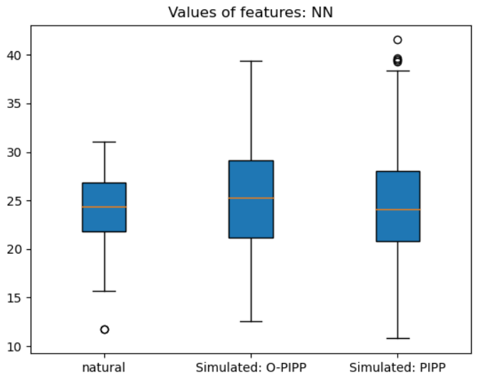

- [Overview](#overview)
- [Spatial features of a `Mosaic`](#spatial-features-of-a-mosaic)
  - [Boundary effects](#boundary-effects)
  - [visualization of points](#visualization-of-points)
  - [Neighborhoods in a `Mosaic`](#neighborhoods-in-a-mosaic)
  - [Nearest Neighbor distances](#nearest-neighbor-distances)
  - [Voronoi Domain areas](#voronoi-domain-areas)
  - [Regularity Index](#regularity-index)
- [Probability distribution of a feature](#probability-distribution-of-a-feature)
  - [Create a feature](#create-a-feature)
  - [Set probabilities in `Distribution`](#set-probabilities-in-distribution)
  - [Visualization of probabilities](#visualization-of-probabilities)
    - [View probabilities of features from `Mosiac`s](#view-probabilities-of-features-from-mosiacs)
    - [Compare features among `Mosiac`s](#compare-features-among-mosiacs)

# Overview

This part guides the feature analysis and visualization of mosiacs.

# Spatial features of a `Mosaic`

## Boundary effects 

```python
boundary_indices = natural_mosaic.get_boundary_indices()
effective_indices = natural_mosaic.get_effective_indices()

# randomly select points
random_indices = natural_mosaic.get_random_indices(n=30) 
# if n >= the number of points, it will return all indices with a random order 
```

## visualization of points

```python
natural_mosaic.draw_points(highlights=effective_indices, nonhighlight_alpha=0.5, ax_grid=5, draw_plane_grid=True, ax_scaled=True, point_args={"color": "k", "s": 20}) 
```

<p align="center">

<figcaption align = "center">Draw effective points in the mosaic.</figcaption>
</p>


```python
natural_mosaic.draw_points(highlights=boundary_indices, nonhighlight_alpha=0.2, ax_grid=5, draw_plane_grid=False, ax_scaled=True, point_args={"color": "r", "s": 40}) 
```

<p align="center">

<figcaption align = "center">Draw boundary points in the mosaic.</figcaption>
</p>


```python
import matplotlib.pyplot as plt
ax1 = plt.subplot(131)
natural_mosaic.draw_points(highlights=effective_indices, nonhighlight_alpha=0.2, ax_grid=5, draw_plane_grid=True, ax_scaled=True, point_args={"color": "r", "s": 20}, ax=ax1) 
ax1.set_title("Solid points are effective")
ax2 = plt.subplot(132)
natural_mosaic.draw_points(highlights=boundary_indices, nonhighlight_alpha=0.2, ax_grid=5, draw_plane_grid=True, ax_scaled=True, point_args={"color": "r", "s": 20}, ax=ax2)
ax2.set_title("Solid points are boundary")
ax3 = plt.subplot(133)
natural_mosaic.draw_points(highlights=random_indices, nonhighlight_alpha=0.2, ax_grid=5, draw_plane_grid=True, ax_scaled=True, point_args={"color": "r", "s": 20}, ax=ax3)
ax3.set_title("Random (N=30) Selection")
plt.show() 
```

<p align="center">

<figcaption align = "center">Subs.</figcaption>
</p>


## Neighborhoods in a `Mosaic`

```python
natural_mosaic.draw_neighbors(highlights=None, nonhighlight_alpha=0.3, ax_grid=1, draw_plane_grid=False, ax_scaled=True, point_args={"s": 5, "color": "r"}, edge_args={"lw": 0.5, "color": "gray"}, ax=None)
```
<p align="center">

<figcaption align = "center">Pairs in the mosiac.</figcaption>
</p>


```python
guy = 16
neighbors = natural_mosaic.find_neighbors(p_index=guy, effective_only=False)
```

```python
import matplotlib.pyplot as plt
ax1 = plt.subplot(121)
natural_mosaic.draw_neighbors(highlights=[guy], nonhighlight_alpha=0.2, ax_grid=5, draw_plane_grid=False, ax_scaled=True, point_args={"color": "red", "s": 30}, edge_args={"lw": 0.5, "color": "gray"}, ax=ax1) 
ax1.set_title("The lucky guy")
ax2 = plt.subplot(122)
natural_mosaic.draw_neighbors(highlights=neighbors, nonhighlight_alpha=0.2, ax_grid=5, draw_plane_grid=False, ax_scaled=True, point_args={"color": "red", "s": 30}, edge_args={"lw": 0.5, "color": "gray"}, ax=ax2)
ax2.set_title("Neighbors of the guy")
plt.show() 
```
<p align="center">

<figcaption align = "center">A cell and its neighbors.</figcaption>
</p>


## Nearest Neighbor distances

```python
# NN distance and the NN neighbor of a point
nn_heighbor, nn_distance = natural_mosaic.find_nearest_neighbor(guy)

# NN distances of effective points
effective_nns = natural_mosaic.get_nns(indices=None, effective_filter=True)

# NN distances of all points
all_nns = natural_mosaic.get_nns(indices=None, effective_filter=False)
```

```python
natural_mosaic.draw_nn_graph(highlights=None, nonhighlight_alpha=0.3, ax_grid=5, draw_plane_grid=False, ax_scaled=True, point_args={"s": 20, "color": "r"}, network_args={"edge_color": "k", "node_size": 0, "with_labels": False}, ax=None)
```
<p align="center">

<figcaption align = "center">Effective points and their NN neighbors.</figcaption>
</p>

## Voronoi Domain areas

```python
# VD areas of effective points
effective_vds = natural_mosaic.get_vorareas(indices=None, effective_filter=True)

# VD areas of all points
all_vds = natural_mosaic.get_vorareas(indices=None, effective_filter=False)
```

```python
natural_mosaic.draw_vorareas(highlights=None, nonhighlight_alpha=0.3, ax_grid=5, ax_scaled=True, plane_args={"facecolor": "gray", "alpha": 0.2}, voronoi_args={"show_points": False, "line_width": 0.5}, point_args={"s": 20, "color": "r"}, ax=None)
```
<p align="center">

<figcaption align = "center">Voronoid domains in the mosiac.</figcaption>
</p>

## Regularity Index

```python
natural_mosaic.NNRI() # 4.966138094971688
natural_mosaic.VDRI() # 5.790713936276296
```

# Probability distribution of a feature

```python
from OPIPP import Distribution
```

## Create a feature

```python
# Distribution of NN distances
nn_distribution = Distribution(method="get_nns", min_value=0, max_value=50, n_bin=20)

# same as `natural_mosaic.get_nns()`
features = nn_distribution.extract_mosaic(natural_mosaic)

# or extract features from a list of mosaics
features = nn_distribution.extract_mosaics([natural_mosaic, simulated_mosaic])
```

```python
# a callable method in defination
vd_distribution = Distribution(method=lambda mosaic: mosaic.get_vorareas(), min_value=0,max_value=4000, n_bin=20)
# same as
vd_distribution = Distribution(method="get_vorareas", min_value=0,max_value=4000, n_bin=20)
```

```python
pattern.set_feature("NN", nn_distribution)
pattern.set_feature("VD", vd_distribution)
```

## Set probabilities in `Distribution`


```python
mosaics = [natural_mosaic]
values = nn_distribution.extract_mosaics(mosaics)
hist = nn_distribution.get_hist(values)
nn_distribution.set_target(hist)
```

```python
# estimate probability with pattern.natural_mosaics
probs = pattern.set_feature_target(feature_label="NN")
```

```python
nn_distribution.view()
```

<p align="center">

<figcaption align = "center">Histogram of NN distances in the mosaic.</figcaption>
</p>

```python
target = np.array([0.        , 0.        , 0.        , 0.0016756 , 0.00670241,
       0.02010724, 0.04356568, 0.08713137, 0.11394102, 0.17258713,
       0.16253351, 0.16253351, 0.1152815 , 0.06635389, 0.0325067 ,
       0.01005362, 0.00268097, 0.00134048, 0.00067024, 0.00033512, 0])
nn_distribution.set_target(target)
```

```python
ax1 = plt.subplot(121)
probs = pattern.set_feature_target(feature_label="NN")
nn_distribution.view(ax=ax1, alpha=0.4, color='gray')
ax1.set_title("Distribution from a mosaic")

ax2 = plt.subplot(122)
nn_distribution.set_target(target)
nn_distribution.view(ax=ax2, alpha=0.7, color='k')
ax2.set_title("Distribution from a dataset")

plt.show()
```
<p align="center">

<figcaption align = "center">Histogram of NN distances from multiple mosaics is more stable.</figcaption>
</p>

## Visualization of probabilities

```python
vd_distribution.set_target(np.array([0.        , 0.        , 0.00608906, 0.0617784 , 0.17183275,
       0.27966751, 0.27633813, 0.13262011, 0.05992875, 0.0117453 ,
       0.        , 0.        , 0.        , 0.        , 0.        ,
       0.        , 0.        , 0.        , 0.        , 0.        , 0.        ]))

print(pattern)
```

```
Spatial pattern of Mouse Horizontal Cell, 
- Density: Unknown,
- Natural mosaics: 1 case(s),
- Simulated mosaics: total 30 case(s)
   0 case(s) in tag 'default',
   10 case(s) in tag 'O-PIPP',
   20 case(s) in tag 'PIPP',
- Features: 2
         Label  | Has target probabilities
         NN     | True
         VD     | True .
```

### View probabilities of features from `Mosiac`s

```python
pattern.draw_feature_hist("NN", natural_color="skyblue", target_color="gray", simulated_color="red", simulated_tag="O-PIPP")
```

<p align="center">

<figcaption align = "center">Natural vs. dataset vs. simulated historgrams.</figcaption>
</p>

### Compare features among `Mosiac`s

```python
ax1 = plt.subplot(121)
pattern.draw_feature_hist("NN", natural_color=None, target_color="gray", simulated_color="red", simulated_tag="O-PIPP", ax=ax1)

ax2 = plt.subplot(122)
pattern.draw_feature_hist("NN", natural_color=None, target_color="gray", simulated_color="red", simulated_tag="PIPP", ax=ax2)

plt.show()
```

<p align="center">

<figcaption align = "center">Compare features in two simulated groups with histograms.</figcaption>
</p>


```python
pattern.draw_values_boxes(feature_label="NN", draw_natural=True, simulated_tags=["O-PIPP", "PIPP"])
```
<p align="center">

<figcaption align = "center">Compare features in two simulated groups with boxplot.</figcaption>
</p>


```python
nnri_distribution = Distribution("NNRI", 10)
pattern.set_feature("NNRI", nnri_distribution)
vdri_distribution = Distribution("VDRI", 10)
pattern.set_feature("VDRI", vdri_distribution)
pattern.draw_values_bars(draw_loss=False, feature_colors={"NNRI": "r", "VDRI": "b"}, draw_natural=False, simulated_tags=["O-PIPP", "PIPP"], width=0.3)
```

<p align="center">

<figcaption align = "center">Compare mean value of features in two simulated groups.</figcaption>
</p>
