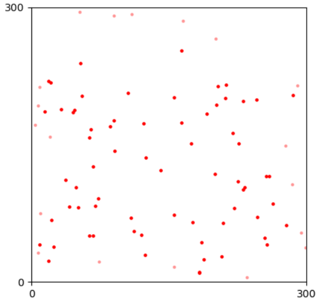
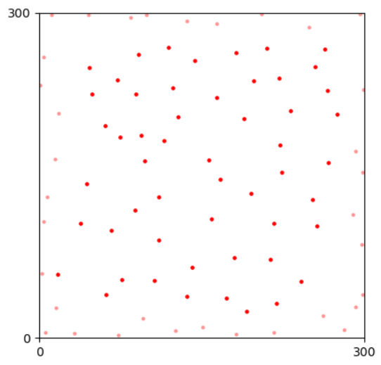
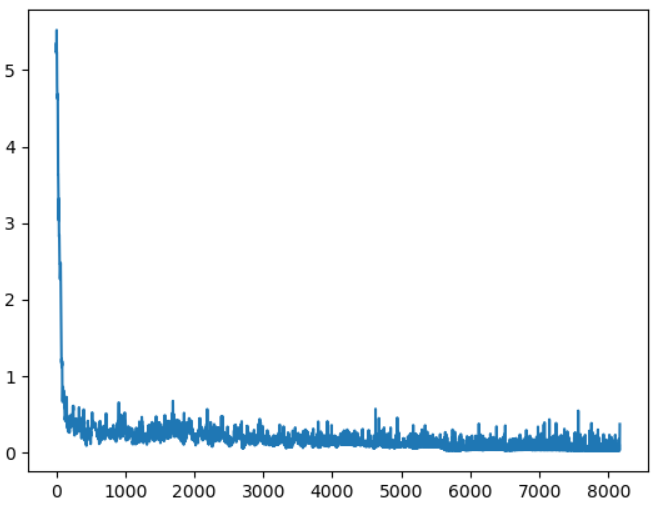
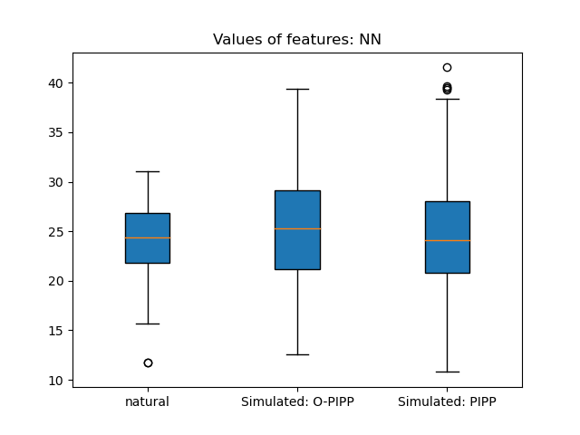
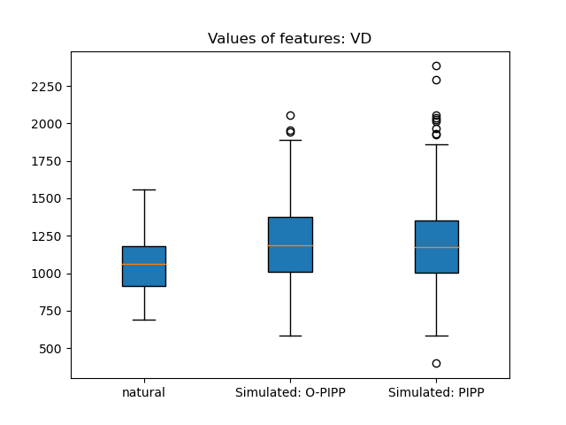
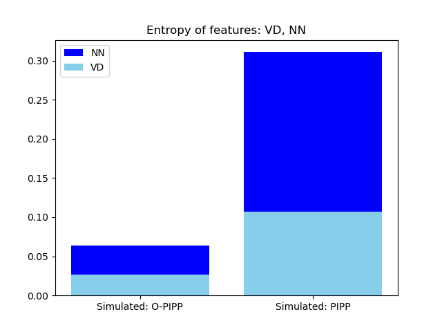

Table of Contents
- [Overview](#overview)
- [Preparation](#preparation)
  - [Set cell density](#set-cell-density)
  - [Interaction function](#interaction-function)
- [Simulation](#simulation)
  - [Creating a random mosaic](#creating-a-random-mosaic)
  - [Check usable features](#check-usable-features)
  - [Optimization Target](#optimization-target)
  - [Optimization Routine](#optimization-routine)
  - [Annealing schedule](#annealing-schedule)
  - [Visualization on optimization](#visualization-on-optimization)
- [Extention](#extention)
  - [Features and Entropy](#features-and-entropy)
  - [Annealing Schedule](#annealing-schedule-1)

# Overview

Before generating a new artificial mosaic, we show information on `pattern` through the previous tutorial, as

```python
print(pattern)
```
The outputs are

```texture
Spatial pattern of Mouse Horizontal Cell, 
- Density: Unknown,
- Natural mosaics: 1 case(s),
- Simulated mosaics: total 30 case(s)
   0 case(s) in tag 'default',
   10 case(s) in tag 'O-PIPP',
   20 case(s) in tag 'PIPP',
- Features: 4
         Label  | Has target probabilities
         NN     | True
         VD     | True
         NNRI   | False
         VDRI   | False .
```

# Preparation

The `Pattern` require more information on natural mosaics for simulation and optimization, including the density of cells and the interaction function between two cells.

## Set cell density

`Pattern` has an `estimate_density` to analyze cell density in natural mosaics, as

```python
density = pattern.estimate_density()
# 87/90000.
```

The cell density tells the number of cells in a mosaic, which is essential in mosaic simulation. We use the `set_density` method to add the density into the `pattern`, as

```python
pattern.set_density(density=density)

pattern.set_density(87/90000.) # direct input the density
print(pattern)
```
Therefore, the "Density" in the outputs has its value.

```
Spatial pattern of Mouse Horizontal Cell, 
- Density: 0.0009667 (cells/unit^2),
- Natural mosaics: 1 case(s),
- Simulated mosaics: total 30 case(s)
   0 case(s) in tag 'default',
   10 case(s) in tag 'O-PIPP',
   20 case(s) in tag 'PIPP',
- Features: 4
         Label  | Has target probabilities
         NN     | True
         VD     | True
         NNRI   | False
         VDRI   | False .
```

## Interaction function

The simulation of mosaic requires an **interaction function**, denoted as `h(u)` to estimate the probability of a distance between any two points in a spatial pattern. With theoretical works from the field of [spatial point pattern analysis](), the formation of the interaction function is flexible. It only has one constraint as `0 <= h(u) <=1` for `u >= 0`.

Here we recommend a well-known formation of `h(u)` for retinal mosaics, as

$$h(u)= \begin{cases} 0,\quad u\leq δ\\ 1-exp(-((u-δ)/φ)^{α}), \quad u>δ \end{cases},$$

where δ, φ, α are parameters estimated by the Poisson point process. Besides, we recommend a [`R` script](estimate_inter_ps.md) to get parameters in $h(u)$. 


With estimated parameters, we can get the callable function through the `get_interaction_func` method, as

```python
parameters = [7.5, 32.1206741, 2.64876305] # [δ, φ, α]
h_func = pattern.get_interaction_func(parameters) 
```

# Simulation

The routine of mosaic simulation is the **insert-update-optimize** framework. It creates a random pattern and updates a cell's position following the probability yield by the interaction function. After an update iteration with several cells, it calculates the performance of the simulated mosaic and uses an adaptive simulated annealing algorithm to ensure the road of the mosaic is towards to given features and their probability distributions. 

In this section, we use NN and VD features as the optimization target and show how to generate a new mosaic in `OPIPP`.

## Creating a random mosaic

The 1st step of the simulation is to create a random mosaic through the `new_mosaic` method, as

```python
mosaic = pattern.new_mosaic(scope=scope)
mosaic.draw_points()
```
<p align="center">

<figcaption align = "center">Random points at initialization.</figcaption>
</p>

You need input a `Scope` to tell the `pattern` how large is the plane.

## Check usable features

Next, you need to decide on features in optimization. A usable feature should have the optimization target through `Feature.set_target` or `Pattern.set_feature_target`. The `pattern` has four features and only the "NN" and the "VD" feature have target probabilities. You can use the `get_usable_features` to check all usable features in the `pattern`.

```python
usable_features = pattern.get_usable_features()
# It is ["NN", "VD"]
```

## Optimization Target

Once we have decided on features for optimization, we can evaluate the `Entropy` of a mosaic by calculating its KL divergence to target features, as

$$Entropy(Simulated)=\sum_{feature}KL(Feature(Simulated), Target_{feature})),$$

where $feature$ and $Feature$ denote a spatial feature and the related method that calculates the probabilistic distribution of features in a given mosaic. The $Entropy$ is the sum of KL divergence between distributions from the simulated mosaic and the $target$.

In `OPIPP`, you can use the `evaluate` method to calculate the entropy of a mosaic or a series of mosaics. For example, we calculate the entropy of the random mosaic as

```python
# input the mosaic and target features
print(pattern.evaluate([mosaic], features=usable_features), SUM=True)
# the entropy of mosaic is 5.233049009275092
# If SUM=False, it will return the list of entropy values, as
print(pattern.evaluate([mosaic, mosaic], features=usable_features), SUM=False)
# It is [5.233049009275092, 5.233049009275092]
```

## Optimization Routine

The `simulate` method in `pattern` play the role of update and optimization.

```python
from OPIPP import AdaptiveSchedule
mosaic, losses = pattern.simulate(mosaic=mosaic, interaction_func=h_func, features=None, schedule=AdaptiveSchedule(), max_step=None, update_ratio=None, save_prefix="examples/simulated/HC/Sample", save_step=500, verbose=True)

# the entropy of the final mosaic
print(pattern.evaluate([mosaic], features=usable_features))
# 0.0288679366606423

mosaic.draw_points()
```

<p align="center">

<figcaption align = "center">Simulated mosaic after optimization.</figcaption>
</p>

Arguments in `simulate` are
- `mosaic`: The input mosaic.
- `interaction_func`: The interaction function, default=`None`. If it is `None`, the method will use `h(u)=1.0` to accept all updates in cells.
- `features`: The target features for optimization, default=`None`. If it is `None`, the method will use all usable features.
- `schedule`: Annealing schedule for simulated annealing algorithm in optimization, default=`AdaptiveSchedule()`. [Here](3.simulation.md#annealing-schedule) is a more complete description. If it is `None`, the method will accept all updates after an iteration.
- `max_step`: The maximum number of iteration steps, default=`None`. If it is `None` and `schedule` is `None` as well, the method will use `20` as the default value. Otherwise, the method will loop until the schedule is terminated or reaches the maximum step of iterations.
- `update_ratio`: The ratio of cells in an iteration step, default=`None`. If it is `None` and `schedule` is `None` as well, the method will use `1.0` as the default value. If it is `None` but `schedule` is not `None`, the method will use `0.01` in an iteration.
- `save_prefix`: Save the mosaics into local files if given. The output file is `save-prefix_index-of-iteraction.points`.
- `save_step`: The step of saving into local files, default=`1`.
- `verbose`: Whether print the change of entropy during optimization, default=`True`.

`loss` is the trace of entropies alongside the optimization. You can plot it as

```python
plt.plot(losses)
plt.show()
```

<p align="center">

<figcaption align = "center">The trace of Entropy during optimization</figcaption>
</p>

Besides, we recommend using `MPI` to simulate multiple mosaics in parallel. [Here](parallel_processing.md) is an example. 

## Annealing schedule

The `OPIPP` use the [simulated annealing algorithm](https://en.wikipedia.org/wiki/Simulated_annealing) to optimize the performance of the simulated mosaic. The algorithm uses a `temperature` to estimate the probability of accepting worse cases and requires an annealing schedule to control the process of iteration. We recommend using the `AdaptiveSchedule` in practice. The creation of an `AdaptiveSchedule` object is

```python
from OPIPP import AdaptiveSchedule
schedule = AdaptiveSchedule(alpha=0.95, init_t=0.5, min_t=1e-4)
```

Arguments are
- `alpha`: The descent parameter in the adaptive schedule, defalut=`0.95`.
- `init_t`: The value of temperature at initialization, default=`0.5`.
- `min_t`: The value of temperature for termination, default=`0.0001`. 

Please check the [adaptive simulated annealing algorithm](https://optimization-online.org/wp-content/uploads/2001/03/291.pdf) for more information.

## Visualization on optimization

After optimization, you load files and view simulation results in the `pattern`. Here, we simulate 10 mosaics and 20 mosaics with different simulation parameters. Output files obtaining points in mosaics are stored in [examples/simulated/HC/](examples/simulated/HC). We use [glob](https://docs.python.org/3/library/glob.html) and `Pattern.load_from_files` to load multiple mosaics, as

```python
from glob import glob

# load simulated mosaics by the O-PIPP method
points_files = glob("examples/simulated/HC/W1_*.points")
pattern.load_from_files(points_files, scope=scope, is_natural=False, simulated_tag="O-PIPP")

# load simulated mosaics by the PIPP method
points_files = glob("examples/simulated/HC/PIPP_*.points")
pattern.load_from_files(points_files, scope=scope, is_natural=False, simulated_tag="PIPP")
```

Then, you can use visualization methods in `pattern` to show values of features and entropy. For example, we compare features in two simulated groups as

```python
# boxplot with feature values
pattern.draw_feature_boxes(feature_label="NN", draw_natural=True, simulated_tags=["O-PIPP", "PIPP"])
pattern.draw_feature_boxes(feature_label="VD", draw_natural=True, simulated_tags=["O-PIPP", "PIPP"])
```

<p align="center">

<figcaption align = "center">Values of nearest Neighbor distances among mosaics</figcaption>
</p>

<p align="center">

<figcaption align = "center">Values of Voronoi domain areas among mosaics</figcaption>
</p>

Furthermore, you can let `draw_loss=True` in `draw_value_bars` to draw values of entropy, as

```python
# bars indicate the mean entropy of features in two groups of mosaics
pattern.draw_value_bars(value_method=np.mean, feature_colors={"VD": "skyblue", "NN": "blue"}, draw_loss=True, draw_natural=False, simulated_tags=["O-PIPP", "PIPP"])
```

<p align="center">

<figcaption align = "center">Compare entropy of two groupds of simulated mosaics</figcaption>
</p>


# Extention

The **insert-update-optimize** framework in `OPIPP` is welcome for spatial features and annealing schedules proposed by users. Here we summarize how to implement customized features and annealing schedules in `OPIPP`.

## Features and Entropy

The core of a feature is the `Feature` class, deciding how to extract features, target values for optimization, and how to calculate entropy during optimization. 

A feature that each cell in the mosaic yields a value and the statistics of a population is significant can follow our [previous examples](2.analysis.md#define-a-feature). However, there are several features not fit the diagram. For instance, the regularity index of a mosaic is a single value. If you want to use these features in mosaic optimization, you should define a new class that inherits the `Feature` and several methods are overridden, including
- `set_target`: Let it know the target value (or values) for optimization. Arguments are flexible. No return value.
- `has_target`: Let it judge itself if it has the target for optimization. No argument for this method. The return is `True` or `False`.
- `extract_mosaic`: Let it know how to calculate features from a single mosaic. It has an argument, the mosaic(`OPIPP.Mosaic`) for processing. The return is a numpy.darray. 
- `extract_mosaics`: Let it know how to calculate features from a list of mosaics. It has an argument, the list of mosaics(`OPIPP.Mosaic`) for processing. The return is a numpy.darray. 
- `entropy`: Let it know how to calculate the entropy with given values. It has an argument, the list of values return by `extract_mosaic` or `extract_mosaics`. The return is a single value.

## Annealing Schedule

`Schedule` class in `OPIPP` is a general definition of the annealing schedule. You can import it and create a new schedule. For example, we define a schedule for log annealing, as

```python
from OPIPP.cooling import Schedule

import numpy as np

class LogSchedule(Schedule): # inherits the original class
    def __init__(self, base: float=2, min_t: float=1e-4, max_update: int=None):
        """
        Override the initialization method.
        The following attributes must be decided,
        - The `min_t` is the threshold. The simulation will be terminated if the temperature is below it.
        - The `max_update` is the max number of iterations. The simulation will be terminated if it reaches the given value. If it is `None`, there is no limitation on the number of iterations.
        """
        # parameters for the log schedule
        self.base = base
        # use the initialization method in `Schedule`
        Schedule.__init__(self, min_t=min_t, max_update=max_update)

    def init(self):
        """ 
        This method is called before simulation.
        You need to set an initial temperature (self.t) and finish the other preparation.
        """
        self.t = self.c/(np.log(2)/np.log(self.base))
        Schedule.init(self)

    def update(self, loss):
        """
        The schedule needs to process a new loss (entropy) and update the temperature (self.t) inside. 
        Besides, the Schedule has an `i_update` attribute to indicate the index of the new loss since the latest `init`.
        """
        self.t = self.c/(np.log(1+self.i_update)/np.log(self.base))
```
