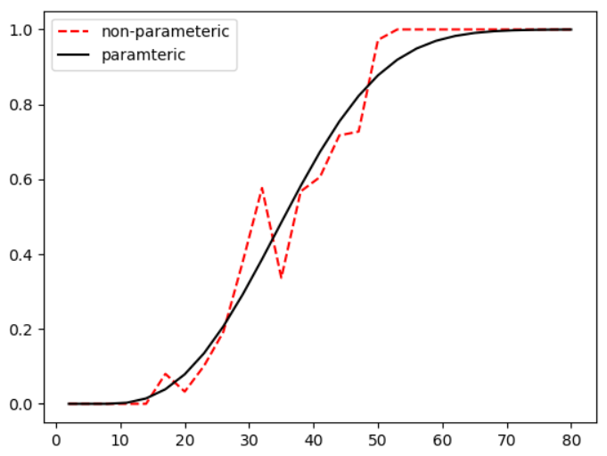

- [Overview](#overview)
- [Installation](#installation)
- [Save points into local files](#save-points-into-local-files)
- [Non-parametric estimation in R](#non-parametric-estimation-in-r)
- [Parametric estimation in OPIPP](#parametric-estimation-in-opipp)

# Overview

The **interaction function** estimate the probability of a distance between any pairs of points. It is well used in the point process model of spatial patterns. The common formulation of the function for mosaic simulation is

$$h(u)= \begin{cases} 0,\quad u\leq θ\\ 1-exp(-((u-θ)/φ)^{α}), \quad u>θ \end{cases},$$

where $h(u)$ denotes the interaction function and $u$ denotes the distance. If `u>θ`, the $h(u)$ chose a sigmoid function. Otherwise the function returns `0`. The threshold `θ` usually use the minimal distance in the spatial pattern, while `φ` and `α` needs a specific estimation method to find their suitable values. 

In this part, we introduce how to use `R` and `OPIPP` to get parameters of the interaction function $h(u)$. Non-parameteric. parametric.

# Installation

The estimation requires the [spatstat](https://spatstat.org/) libaray in [R](https://www.r-project.org/) environment. For installing `R`, you can get download and related intructions from [here](https://cran.r-project.org/). After installation of the enviroment, please open `R`, the `RGui` or `Rterm`, usually both are already installed. You can find a console and please type the following line to install the `spatstat` package,

```R
install.packages('spatstat')
```

We recommend to learn basic of the `R` language for further usages. In this part, we suppose you new the basic of a retinal mosaic and the usage of the `OPIPP` module. Futhermore, you need to modify R scripts for your own simulations.

# Save points into local files

```python
# Separate coordinates into two texture files
# the 1st is "examples/natural/HC/F8-1-points-x.txt" with x-coordinates
# the 2nd is "examples/natural/HC/F8-1-points-y.txt" with y-coordinates
natural_mosaic.save("examples/natural/HC/F8-1-points.txt", separate=True)
```

# Non-parametric estimation in R

running R with the following script.

```R
# import libraries
library(spatstat)
library(pracma)

x <- scan("examples/natural/HC/F8-1-points-x.txt") # x axis of points
y <- scan("examples/natural/HC/F8-1-points-y.txt") # y axis of points
# x-axis values in the interaction function
r <- linspace(2, 50, 17) # similar to numpy.linsapce
# r is an arithmetic sequence from 2 to 50 and the step is 3
# It means the estimate will yield a list of probability corresponding to distances from 2 to 50.
# It is best to modify these values depending on the value range of distances in given mosaic.

u <- ppp(x, y, c(0, len), c(0, len)) # c(min_x, max_y) and c(min_y, max_y), the corresponding attributes in OPIPP.Scope
fit <- ppm(u ~1, PairPiece(r = r))

# draw results
plot(fitin(fit)) 

# write results to local files
write.table(parameters(fit)$gammas, "examples/natural/HC/F8-1-h-gammas.txt", row.names = FALSE, col.names = FALSE)
write.table(parameters(fit)$r, "examples/natural/HC/F8-1-h-r.txt", row.names = FALSE, col.names = FALSE)
```

# Parametric estimation in OPIPP

delta is the mininal NN distance

```python
import numpy as np
from OPIPP.utils import estimate_interaction

# load non-parametric estimation results
gammas = np.loadtxt("examples/natural/HC/F8-1-h-gammas.txt")
rs = np.loadtxt("examples/natural/HC/F8-1-h-r.txt")

# return is [7.5, 32.12066166693056, 2.6487686148563743]
# corresponding to [θ, φ, α]
parameters = estimate_interaction(gammas, rs, theta=7.5, draw=True) 

# at last, we get the interaction function
h_func = pattern.get_interaction_func(parameters) 
```

<p align="center">

<figcaption align = "center">Curves of the interaction function for the HC mosaic.</figcaption>
</p>
